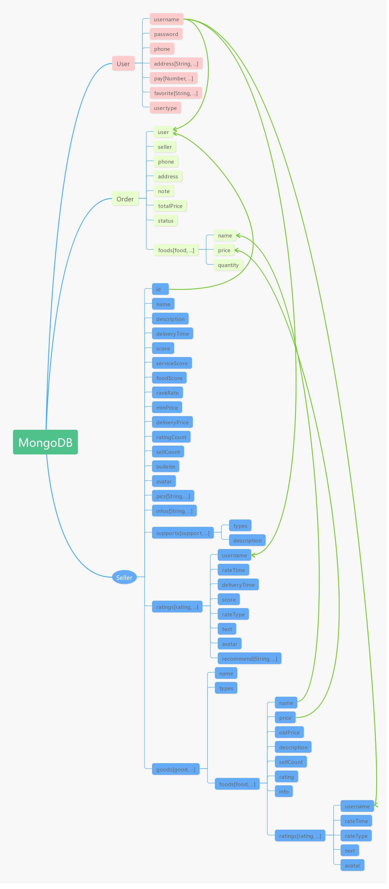
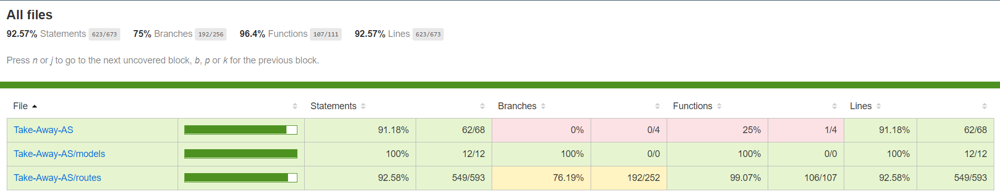

# Assignment 1 - Agile Software Practice.

[](https://gitlab.com/Sam1224/take-away-as-test/commits/master)

[](https://gitlab.com/Sam1224/take-away-as-test/badges/master/coverage.svg?job=coverage)

- [Github](https://github.com/Sam1224/Take-Away-AS-Test)
- [Gitlab](https://gitlab.com/Sam1224/take-away-as-test)
- [Assignment 1 - Agile Software Practice.](#assignment-1---agile-software-practice)
  * [Personal Information.](#personal-information)
  * [Environment.](#environment)
  * [Usage.](#usage)
  * [Overview.](#overview)
  * [API endpoints.](#api-endpoints)
  * [Data model.](#data-model)
  * [Sample Test execution.](#sample-test-execution)
  * [Extra features.](#extra-features)

<small><i><a href='http://ecotrust-canada.github.io/markdown-toc/'>Table of contents generated with markdown-toc</a></i></small>

## Personal Information.

Name: Qianxiong Xu

ID: 20086454

## Environment.
- OS: Windows 10
- Node: v10.16.3

## Usage.
- Clone:
```
git clone https://github.com/Sam1224/Take-Away-AS-Test.git
```
- Configure:
```
cd <your_dir>
npm install
```
- Run:
```
npm run start
```
- Test:
```
npm run test
```
- Generate coverage report:
```
npm run test:report
```

## Overview.

This project aims at testing the backend of a takeaway app programmed for Web Application Development 2.

Basically, there are `3` schemas and the related models: `user`, `seller` and `order`.

`31` APIs are provided to do the basic `CRUD` operations, the concrete usages are described in [API endpoints Section](#api-endpoints).

There are `108` test cases in total, a sample testing running output is shown in [Sample Test execution Section](#sample-test-execution).

## API endpoints.

3 test files are provided to do the `integration testing`:
- [`test-user`](./test/functional/api/test-user.js)
- [`test-seller`](./test/functional/api/test-seller.js)
- [`test-order`](./test/functional/api/test-order.js)

There are `31` APIs in total, with `11 GET`, `9 POST`, `4 PUT` and `7 DELETE`. They are listed as follow:`
- [`user` ](./routes/user.js)
    - GET       -   findAll
        - `GET /user`
        - Return a list of all users.
        - No need for jwt authentication.
        - `localhost:3000/user`
    - GET       -   findOne
        - `GET /user/:id`
        - Return one user by `id`.
        - No need for jwt authentication.
        - `localhost:3000/user/:id`
    - POST      -   addUser
        - `POST /user`
        - Add a new user.
        - No need for jwt authentication.
        - `localhost:3000/user`
            - `username`:   'xxx'
            - `password`:   'xxx' (password will be encrypted by `sha1`)
            - `phone`:      xxx
    - PUT       -   updateUser
        - `PUT /user`
        - Update the password and phone of a user.
        - Need jwt authentication.
        - `localhost:3000/user`
            - `username`:   'xxx'
            - `password`:   'xxx'
            - `phone`:      xxx
            - `token`:      'xxx'
    - POST      -   login
        - `POST /login`
        - Login and get the jwt token.
        - The api invoked to get the jwt token, no need itself.
        - `localhost:3000/login`
            - `username`:   'xxx'
            - `password`:   'xxx'
    - DELETE    -   deleteUser
        - `DELETE /user/:id`
        - Delete one user by `id`.
        - No need for jwt authentication.
        - `localhost:3000/user/:id`
    - POST      -   addAddress
        - `POST /user/address`
        - Add one address to the address list of a user identified by `username`.
        - Need jwt authentication.
        - `localhost:3000/user/address`
            - `username`:   'xxx'
            - `address`:    'xxx'
            - `token`:      'xxx'
    - DELETE    -   deleteAddress
        - `DELETE /user/address`
        - Delete one address from the address list of a user identified by `username`.
        - Need jwt authentication.
        - `localhost:3000/user/address`
            - `username`:   'xxx'
            - `address`:    'xxx'
            - `token`:      'xxx'
    - POST      -   addPay
        - `POST /user/pay`
        - Add one bank card to the payment list of a user identified by `username`.
        - Need jwt authentication.
        - `localhost:3000/user/pay`
            - `username`:   'xxx'
            - `pay`:        'xxx'
            - `token`:      'xxx'
    - DELETE    -   deletePay
        - `DELETE /user/pay`
        - Delete one bank card from the payment list of a user identified by `username`.
        - Need jwt authentication.
        - `localhost:3000/user/pay`
            - `username`:   'xxx'
            - `pay`:        'xxx'
            - `token`:      'xxx'
    - POST      -   addFavorite
        - `POST /user/favorite`
        - Add one seller id to the favorite list of a user identified by `username`.
        - Need jwt authentication.
        - `localhost:3000/user/favorite`
            - `username`:   'xxx'
            - `favorite`:   'xxx'
            - `token`:      'xxx'
    - DELETE    -   deleteFavorite
        - `DELETE /user/favorite`
        - Delete one seller id from the favorite list of a user identified by `username`.
        - Need jwt authentication.
        - `localhost:3000/user/favorite`
            - `username`:   'xxx'
            - `favorite`:   'xxx'
            - `token`:      'xxx'
- `seller` (./routes/seller.js)
    - GET       -   findAll
        - `GET /seller`
        - Return a list of all sellers.
        - No need for jwt authentication.
        - `localhost:3000/seller`
    - GET       -   findOne
        - `GET /seller/:id`
        - Return one seller by `id`.
        - No need for jwt authentication.
        - `localhost:3000/seller/:id`
    - POST      -   addSeller
        - `POST /seller`
        - Add a new seller.
        - Need jwt authentication.
        - `localhost:3000/seller`
            - `name`:           'xxx'
            - `description`:    'xxx'
            - `deliveryTime`:   30
            - `bulletin`:       'xxx'
            - `supports`:       [{'types': 1, 'description': 'xxx'}, ...]
            - `avatar`:         'url'
            - `pics`:           ['xxx', ...]
            - `infos`:          ['xxx', ...]
            - `token`:          'xxx'
    - PUT       -   updateSeller
        - `PUT /seller/:id`
        - Modify the basic information of a seller identified by `id`.
        - Need jwt authentication.
        - `localhost:3000/seller/:id`
            - `name`:           'xxx'
            - `description`:    'xxx'
            - `deliveryTime`:   40
            - `bulletin`:       'xxx'
            - `supports`:       [{'types': 0, 'description': 'xxx'}, ...]
            - `avatar`:         'url'
            - `pics`:           ['xxx', ...]
            - `infos`:          ['xxx', ...]
            - `token`:          'xxx'
    - DELETE    -   deleteSeller
        - `DELETE /seller/:id`
        - Delete one seller identified by `id`.
        - Need jwt authentication.
        - `localhost:3000/seller/:id`
            - `token`:  'xxx'
    - PUT       -   updateGoods
        - `PUT /seller/:id/goods`
        - Update the information of goods of a seller identified by `id`.
        - Need jwt authentication.
        - `localhost:3000/seller/:id/goods`
            - `goods`: [{
                'name': 'Hot sales',
                'types': -1,
                'foods': [{
                    'name': 'xxx',
                    'price': 10,
                    'oldPrice': '',
                    'description': 'xxx',
                    'info': '',
                    'icon': 'url',
                    'image': 'url'
                }, ...]
            }, ...]
            - `token`: 'xxx'
    - POST      -   addRating
        - `POST /seller/:id/ratings`
        - Add one rating to the rating list of a user identified by `id`.
        - Need jwt authentication.
        - `localhost:3000/seller/:id/ratings`
            - `username`:       'xxx',
            - `deliveryTime`:   30,
            - `score`:          5,
            - `rateType`:       0,
            - `text`:           'xxx',
            - `avatar`:         'url',
            - `recommend`:      ['xxx', ...]
            - `token`:          'xxx'
    - DELETE    -   deleteRating
        - `DELETE /seller/:id/ratings`
        - Delete one rating from the rating list of a user identified by `id`.
        - Need jwt authentication.
        - `localhost:3000/seller/:id/ratings`
            - `username`:       'xxx',
            - `deliveryTime`:   30,
            - `score`:          5,
            - `rateType`:       0,
            - `text`:           'xxx',
            - `avatar`:         'url',
            - `recommend`:      ['xxx', ...]
            - `token`:          'xxx'
    - POST      -   fuzzySearch
        - `POST /seller/search`
        - Fuzzy search for sellers.
        - No need for jwt authentication.
        - `localhost:3000/seller/search`
            - `keyword`: 'xxx'
    - GET       -   getTopSellersBySellCount
        - `GET /seller/sellcount/:num/:seq`
        - Get the top n sellers whose sell counts are the highest.
        - No need for jwt authentication.
        - `localhost:3000/seller/sellcount/:num/:seq`
    - GET       -   getTopSellersByRankRate
        - `GET /seller/rankrate/:num/:seq`
        - Get the top n sellers whose rank rates are the highest.
        - No need for jwt authentication.
        - `localhost:3000/seller/rankrate/:num/:seq`
- `order` (./routes/order.js)
    - GET       -   findAll
        - `GET /order`
        - Return a list of all orders.
        - Need jwt authenticattion.
        - `localhost:3000/order`
            - `token`:  'xxx'
    - GET       -   findOne
        - `GET /order/:id`
        - Return one order identified by `id`.
        - Need jwt authentication.
        - `localhost:3000/order/:id`
            - `token`:  'xxx'
    - GET       -   findAllByUser
        - `GET /order/user/:id`
        - Return a list of all orders belong to one user identified by `id`.
        - Need jwt authentication.
        - `localhost:3000/order/user/:id`
            - `token`:  'xxx'
    - GET       -   findAllBySeller
        - `GET /order/seller/:id`
        - Return a list of all orders belong to one seller identified by `id`.
        - Need jwt authentication.
        - `localhost:3000/order/seller/:id`
            - `token`:  'xxx'
    - POST      -   addOrder
        - `POST /order`
        - Create a new order.
        - Need jwt authentication.
        - `localhost:3000/order`
            - `user`: 'xxx'
            - `seller`: 'xxx'
            - `address`: ''
            - `phone`: xxx
            - `note`: 'xxx'
            - `foods`: [{
                          'name': 'xxx',
                          'price': 10,
                          'quantity': 2
                      }, ...]
            - `token`: 'xxx'
    - DELETE    -   deleteOrder
        - `DELETE /order/:id`
        - Delete one order identified by `id`.
        - Need jwt authentication.
        - `localhost:3000/order/:id`
            - `user`: 'xxx'
            - `seller`: 'xxx'
            - `address`: ''
            - `phone`: xxx
            - `note`: 'xxx'
            - `foods`: [{
                          'name': 'xxx',
                          'price': 10,
                          'quantity': 2
                      }, ...]
            - `token`: 'xxx'
    - PUT       -   commentOrder
        - `PUT /order/:id`
        - Comment for one order identified by `id`.
        - Need jwt authentication.
        - `localhost:3000/order/:id`
            - `seller`: 'xxx',
            - `username`: 'xxx'
            - `deliveryTime`: 30
            - `score`: 5
            - `rateType`: 0
            - `text`: ''
            - `avatar`: 'url'
            - `recommend`: ['xxx', ...]
            - `token`: 'xxx'
    - GET       -   getTopFood
        - `GET /topfood/:user/:seller/:num`
        - Get a user's top n foods from one/all seller(s).
        - Need jwt authentication.
        - `localhost:3000/topfood/:user/:seller/:num`
            - `token`: 'xxx'

## Data model.

There are 3 data models:

| Data Model | Schema | Samlple Data |
| ---------- | ------ | ------------ |
| User | [User Schema](./models/user.js) | [User Sample Data](./data/user.js) |
| Seller | [Seller Schema](./models/seller.js) | [Seller Sample Data](./data/seller.js) |
| Order | [Order Schema](./models/order.js) | [Order Sample Data](./data/order.js) |



## Sample Test execution.

- Test:

If the test failed and get a notice like `...exceed 6000ms...`, go to `package.json` and find the `test script`, modify the value after `--timeout` into a larger value, like `10000`
```
npm run test
```

- Sample test result:

The following code block includes the outputs of running test scripts.

~~~
> take-away-as@0.0.0 test D:\Project\JupyterNotebook\Blog\Web Development\Take-Away-AS
> cross-env NODE_ENV=test mocha --timeout 6000 test/functional/api/*.js --exit


  User
    GET /user
(node:21908) DeprecationWarning: current URL string parser is deprecated, and will be removed in a future version. To use the new parser, pass option { useNewUrlParser: true } to MongoClient.connect.
(node:21908) DeprecationWarning: current Server Discovery and Monitoring engine is deprecated, and will be removed in a future version. To use the new Server Discover and Monitoring engine, pass option { useUnifiedTopology: true } to the MongoClient
 constructor.
connected to database
GET /user 200 107.131 ms - 872
      √ should GET all the users (127ms)
    GET /user/:id
      when the id is valid
GET /user/5dbc5526ad0b9a55944f0057 200 105.201 ms - 522
        √ should return the matching user (110ms)
      when the id is invalid
GET /user/1 200 1.400 ms - 285
        √ should return an empty array
    POST /user
      when the username is already in database
POST /user 200 110.436 ms - 71
        √ should return a message to inform the duplication (113ms)
      when the username is unique
POST /user 200 208.942 ms - 59
        √ should return a message of successfully add user (212ms)
GET /user 200 99.056 ms - 1223
    PUT /user
      when there is no jwt token
PUT /user 200 0.386 ms - 65
        √ should require to login if it does not have a jwt token
      when there is a jwt token
        when the token is invalid
PUT /user 200 1.341 ms - 119
          √ should return an invalid error
        when the token is valid
          when the username is not registered
PUT /user 200 99.520 ms - 68
            √ should return a message the username is not registered (102ms)
          when the username is registered
PUT /user 200 203.598 ms - 62
            √ should return a message of successfully update user (206ms)
GET /user 200 113.727 ms - 875
    DELETE /user/:id
      when the id is valid
(node:21908) DeprecationWarning: Mongoose: `findOneAndUpdate()` and `findOneAndDelete()` without the `useFindAndModify` option set to false are deprecated. See: https://mongoosejs.com/docs/deprecations.html#-findandmodify-
DELETE /user/5dbc552aad0b9a55944f0068 200 105.364 ms - 62
        √ should return a message of successfully delete user (115ms)
GET /user 200 100.487 ms - 390
      when the id is invalid
DELETE /user/123 200 0.338 ms - 291
        √ should return an error
    POST /user/address
      when there is no jwt token
POST /user/address 200 0.306 ms - 65
        √ should require to login if it does not have a jwt token
      when there is a jwt token
        when the token is invalid
POST /user/address 200 0.388 ms - 119
          √ should return an invalid error
        when the token is valid
          when the username is not registered
POST /user/address 200 99.153 ms - 68
            √ should return a message the username is not registered (101ms)
          when the username is registered
(node:21908) DeprecationWarning: collection.update is deprecated. Use updateOne, updateMany, or bulkWrite instead.
POST /user/address 200 204.065 ms - 62
            √ should return a message of successfully add address (206ms)
GET /user 200 100.317 ms - 965
    DELETE /user/address
      when there is no jwt token
DELETE /user/address 200 0.326 ms - 65
        √ should require to login if it does not have a jwt token
      when there is a jwt token
        when the token is invalid
DELETE /user/address 200 0.431 ms - 119
          √ should return an invalid error
        when the token is valid
          when the username is not registered
DELETE /user/address 200 99.982 ms - 68
            √ should return a message the username is not registered (102ms)
          when the username is registered
DELETE /user/address 200 216.065 ms - 65
            √ should return a message of successfully delete address (218ms)
GET /user 200 103.260 ms - 821
    POST /user/pay
      when there is no jwt token
POST /user/pay 200 0.342 ms - 65
        √ should require to login if it does not have a jwt token
      when there is a jwt token
        when the token is invalid
POST /user/pay 200 0.437 ms - 119
          √ should return an invalid error
        when the token is valid
          when the username is not registered
POST /user/pay 200 110.032 ms - 68
            √ should return a message the username is not registered (113ms)
          when the username is registered
POST /user/pay 200 224.990 ms - 62
            √ should return a message of successfully add pay (228ms)
GET /user 200 127.285 ms - 913
    DELETE /user/pay
      when there is no jwt token
DELETE /user/pay 200 0.317 ms - 65
        √ should require to login if it does not have a jwt token
      when there is a jwt token
        when the token is invalid
DELETE /user/pay 200 0.502 ms - 119
          √ should return an invalid error
        when the token is valid
          when the username is not registered
DELETE /user/pay 200 98.688 ms - 68
            √ should return a message the username is not registered (100ms)
          when the username is registered
DELETE /user/pay 200 198.381 ms - 65
            √ should return a message of successfully add pay (201ms)
GET /user 200 100.818 ms - 834
    POST /user/favorite
      when there is no jwt token
POST /user/favorite 200 0.311 ms - 65
        √ should require to login if it does not have a jwt token
      when there is a jwt token
        when the token is invalid
POST /user/favorite 200 0.346 ms - 119
          √ should return an invalid error
        when the token is valid
          when the username is not registered
POST /user/favorite 200 99.672 ms - 68
            √ should return a message the username is not registered (102ms)
          when the username is registered
POST /user/favorite 200 198.589 ms - 63
            √ should return a message of successfully add pay (200ms)
GET /user 200 99.359 ms - 920
    DELETE /user/favorite
      when there is no jwt token
DELETE /user/favorite 200 0.349 ms - 65
        √ should require to login if it does not have a jwt token
      when there is a jwt token
        when the token is invalid
DELETE /user/favorite 200 0.340 ms - 119
          √ should return an invalid error
      when the token is valid
        when the username is not registered
DELETE /user/favorite 200 104.686 ms - 68
          √ should return a message the username is not registered (106ms)
        when the username is registered
DELETE /user/favorite 200 197.909 ms - 66
          √ should return a message of successfully delete pay (199ms)
GET /user 200 98.662 ms - 829
    POST /login
      when the username is not registered
POST /login 200 101.453 ms - 68
        √ should return a message the username is not registered (104ms)
      when the username is registered
        when the password is wrong
POST /login 200 103.371 ms - 59
          √ should return a message the password is wrong (105ms)
        when the password is correct
POST /login 200 98.576 ms - 243
          √ should return a token and a message showing successfully login, use your token (100ms)

  Seller
    GET /seller
GET /seller 200 103.793 ms - 3055
      √ should GET all the sellers (107ms)
    GET /seller/:id
      when the id is valid
GET /seller/5dbc553bad0b9a55944f00a6 200 110.216 ms - 2108
        √ should return the matching seller (113ms)
      when the id is invalid
GET /seller/1 200 0.631 ms - 287
        √ should return an empty array
    POST /seller
      when there is no jwt token
POST /seller 200 0.690 ms - 65
        √ should require to login if it does not have a jwt token
      when there is a jwt token
        when the token is invalid
POST /seller 200 0.542 ms - 119
          √ should return an invalid error
        when the token is valid
POST /seller 200 135.496 ms - 61
Successfully Add Seller
          √ should return a message of successfully add seller (140ms)
GET /seller 200 102.767 ms - 4485
    PUT /seller/:id
      when there is no jwt token
        √ should require to login if it does not have a jwt token
      when there is a jwt token
        when the token is invalid
          √ should return an invalid error
        when the token is valid
PUT /seller/5dbc5540ad0b9a55944f00c4 200 0.302 ms - 65
PUT /seller/5dbc5540ad0b9a55944f00c4 200 202.403 ms - 64
          √ should return a message of successfully update seller (205ms)
GET /seller 200 103.486 ms - 3054
    DELETE /seller/:id
      when there is no jwt token
PUT /seller/5dbc5540ad0b9a55944f00c4 200 0.413 ms - 119
        √ should require to login if it does not have a jwt token
      when there is a jwt token
        when the token is invalid
          √ should return an invalid error
        when the token is valid
DELETE /seller/5dbc5542ad0b9a55944f00d1 200 100.923 ms - 64
          √ should return a message of successfully delete seller (103ms)
DELETE /seller/5dbc5542ad0b9a55944f00d1 200 0.328 ms - 65
GET /seller 200 99.651 ms - 987
    PUT /seller/:id/goods
      when there is no jwt token
DELETE /seller/5dbc5542ad0b9a55944f00d1 200 0.411 ms - 119
        √ should require to login if it does not have a jwt token
      when there is a jwt token
        when the token is invalid
PUT /seller/5dbc5543ad0b9a55944f00d9/goods 200 0.416 ms - 119
          √ should return an invalid error
        when the token is valid
PUT /seller/5dbc5543ad0b9a55944f00dd/goods 200 0.246 ms - 65
PUT /seller/5dbc5543ad0b9a55944f00dd/goods 200 207.041 ms - 63
          √ should return a message of successfully update goods of seller (209ms)
GET /seller/5dbc5543ad0b9a55944f00dd 200 143.419 ms - 3232
    POST /seller/:id/ratings
      when there is no jwt token
        √ should require to login if it does not have a jwt token
      when there is a jwt token
        when the token is invalid
POST /seller/5dbc5544ad0b9a55944f00e7/ratings 200 0.495 ms - 119
          √ should return an invalid error
        when the token is valid
POST /seller/5dbc5545ad0b9a55944f00eb/ratings 200 0.238 ms - 65
POST /seller/5dbc5545ad0b9a55944f00eb/ratings 200 329.196 ms - 61
          √ should return a message of successfully add rating of seller (332ms)
GET /seller/5dbc5545ad0b9a55944f00eb 200 167.382 ms - 2787
    DELETE /seller/:id/ratings
      when there is no jwt token
        √ should require to login if it does not have a jwt token
      when there is a jwt token
        when the token is invalid
DELETE /seller/5dbc5546ad0b9a55944f00f4/ratings 200 0.431 ms - 119
          √ should return an invalid error
        when the token is valid
DELETE /seller/5dbc5547ad0b9a55944f00f8/ratings 200 0.363 ms - 65
DELETE /seller/5dbc5547ad0b9a55944f00f8/ratings 200 307.642 ms - 64
          √ should return a message of successfully add rating of seller (312ms)
GET /seller/5dbc5547ad0b9a55944f00f8 200 99.188 ms - 1474
    POST /seller/search
      when the keyword is not empty
POST /seller/search 200 108.003 ms - 3055
        √ should GET all the satisfying sellers (112ms)
      when the keyword is empty
POST /seller/search 200 107.726 ms - 3055
        √ should GET all the sellers (111ms)
    GET /seller/sellcount/:num/:seq
      when num is a valid integer
        when seq is -1
GET /seller/sellcount/3/-1 200 107.469 ms - 6267
          √ should return a list descending by sellCount (111ms)
        when seq is 1
GET /seller/sellcount/3/1 200 101.643 ms - 6264
          √ should return a list ascending by sellCount (106ms)
        when seq is either -1 or 1
GET /seller/sellcount/3/-1 200 102.600 ms - 6267
          √ should return a list descending by sellCount (105ms)
      when num is a valid float number
GET /seller/sellcount/2.5/-1 200 182.524 ms - 4197
        √ should be treated as the largest integer less than the num (185ms)
      when num is larger than the num of all sellers
GET /seller/sellcount/10/-1 200 109.184 ms - 10406
        √ should return all sellers (112ms)
      when num is a negative integer
GET /seller/sellcount/-2/-1 200 100.932 ms - 4197
        √ should be treated as its absolute value (104ms)
      when num is a negative float number
GET /seller/sellcount/-2.5/-1 200 102.437 ms - 4197
        √ should be treated as the smallest integer larger than the num and then do the absolute operation (106ms)
    GET /seller/rankrate/:num/:seq
      when num is a valid integer
        when seq is -1
GET /seller/rankrate/3/-1 200 102.674 ms - 6264
          √ should return a list descending by rankRate (105ms)
        when seq is 1
GET /seller/rankrate/3/1 200 100.442 ms - 6266
          √ should return a list ascending by rankRate (103ms)
        when seq is either -1 or 1
GET /seller/rankrate/3/0 200 101.170 ms - 6264
          √ should return a list descending by rankRate (105ms)
      when num is a valid float number
GET /seller/rankrate/2.5/-1 200 102.632 ms - 4195
        √ should be treated as the largest integer less than the num (105ms)
      when num is larger than the num of all sellers
GET /seller/rankrate/10/-1 200 103.808 ms - 10406
        √ should return all sellers (108ms)
      when num is a negative integer
GET /seller/rankrate/-2/-1 200 103.884 ms - 4195
        √ should be treated as its absolute value (107ms)
      when num is a negative float number
GET /seller/rankrate/-2.5/-1 200 105.021 ms - 4195
        √ should be treated as the smallest integer larger than the num and then do the absolute operation (111ms)

  Order
    GET /order
      when there is no jwt token
GET /order 200 0.669 ms - 65
        √ should require to login if it does not have a jwt token
      when there is a jwt token
        when the token is invalid
GET /order 200 0.563 ms - 119
          √ should return an invalid error
        when the token is valid
GET /order 200 100.813 ms - 2012
          √ should return all orders  (104ms)
    GET /order/user/:id
      when there is no jwt token
GET /order/user/user2 200 0.727 ms - 65
        √ should require to login if it does not have a jwt token
      when there is a jwt token
        when the token is invalid
GET /order/user/user2 200 0.597 ms - 119
          √ should return an invalid error
        when the token is valid
          when the user id is valid
GET /order/user/user2 200 100.261 ms - 1364
            √ should return all orders of a user (103ms)
          when the user id is invalid
GET /order/user/a 200 186.521 ms - 35
            √ should return an empty array (190ms)
    GET /order/seller/:id
      when there is no jwt token
GET /order/seller/seller1 200 0.834 ms - 65
        √ should require to login if it does not have a jwt token
      when there is a jwt token
        when the token is invalid
GET /order/seller/seller1 200 0.600 ms - 119
          √ should return an invalid error
        when the token is valid
          when the seller id is valid
GET /order/seller/seller1 200 102.687 ms - 1350
            √ should return all orders of a seller (106ms)
          when the seller id is invalid
GET /order/seller/a 200 152.012 ms - 35
            √ should return an empty array (156ms)
    GET /order/:id
      when there is no jwt token
GET /order/5dbc5569ad0b9a55944f0271 200 0.573 ms - 65
        √ should require to login if it does not have a jwt token
      when there is a jwt token
        when the token is invalid
GET /order/5dbc556aad0b9a55944f027a 200 0.636 ms - 119
          √ should return an invalid error
        when the token is valid
          when the id is valid
GET /order/5dbc556aad0b9a55944f0283 200 100.229 ms - 688
            √ should return an order (103ms)
          when the id is invalid
GET /order/a 200 1.586 ms - 286
            √ should return an error
    POST /order
      when there is no jwt token
POST /order 200 0.320 ms - 65
        √ should require to login if it does not have a jwt token
      when there is a jwt token
        when the token is invalid
POST /order 200 0.464 ms - 119
          √ should return an invalid error
        when the token is valid
POST /order 200 133.245 ms - 60
          √ should return a message of successfully add order (138ms)
GET /order/user/user3 200 100.111 ms - 971
    DELETE /order/:id
      when there is no jwt token
DELETE /order/5dbc556fad0b9a55944f02b3 200 0.336 ms - 65
        √ should require to login if it does not have a jwt token
      when there is a jwt token
        when the token is invalid
DELETE /order/5dbc5570ad0b9a55944f02bc 200 0.377 ms - 119
          √ should return an invalid error
        when the token is valid
          when the id is valid
DELETE /order/5dbc5571ad0b9a55944f02c5 200 100.338 ms - 63
            √ should return a message of successfully add order (104ms)
GET /order 200 99.386 ms - 1364
          when the id is invalid
DELETE /order/123 200 0.539 ms - 292
            √ should return an error
    PUT /order/:id
      when there is no jwt token
PUT /order/5dbc5573ad0b9a55944f02d7 200 0.855 ms - 65
        √ should require to login if it does not have a jwt token
      when there is a jwt token
        when the token is invalid
PUT /order/5dbc5574ad0b9a55944f02e0 200 0.519 ms - 119
          √ should return an invalid error
        when the token is valid
PUT /order/5dbc5574ad0b9a55944f02e9 200 304.403 ms - 63
          √ should return a message of successfully update order (307ms)
GET /seller/5dbc5575ad0b9a55944f02ef 200 100.680 ms - 2783
    GET /order/topfood/:user/:seller/:num
      when there is no jwt token
GET /order/topfood/user1/seller1/3 200 0.563 ms - 65
        √ should require to login if it does not have a jwt token
      when there is a jwt token
        when the token is invalid
GET /order/topfood/user1/seller1/3 200 0.806 ms - 119
          √ should return an invalid error
        when the token is valid
          when the user id is invalid
GET /order/topfood/u/seller1/3 200 102.495 ms - 65
            √ should return a message there are no related orders (106ms)
          when the user id is valid
            when the seller id is invalid
GET /order/topfood/user1/s/3 200 99.482 ms - 65
              √ should return a message there are no related orders (104ms)
            when the seller id is valid
              when the num is a valid integer
GET /order/topfood/user1/seller1/3 200 104.881 ms - 234
                √ should return return an array of the top n foods with the most buying times (108ms)
              when the num is invalid
                when the num is 0
GET /order/topfood/user1/seller1/0 200 105.447 ms - 234
                  √ should be treated as 3 by default (109ms)
                when the num is a float number
GET /order/topfood/user1/seller1/3.5 200 102.210 ms - 234
                  √ should be treated as the largest integer smaller than num (105ms)
                when the num is larger than the total num of types of foods ordered
GET /order/topfood/user1/seller1/10 200 104.545 ms - 283
                  √ should return all the foods ordered and the order times (108ms)


  108 passing (2m)

~~~

## Extra features.

There are some extra features I'd like to highlight to denote my attitude towards this project, I will explain by using the `Grading Spectrum` lecturer provides:
- Outstanding (80-100%): Theme - Independent learning.
    - Testing:
        - Target:
            - Single resource.
            - CRUD behavior.
            - Endpoints:
                - There are `31` APIs, with `11 GET`, `9 POST`, `4 PUT` and `7 DELETE`.
            - Data model:
                - 3 pretty `complex data models` with schema nesting.
            - Authentication:
                - Use `jsonwebtoken` to achieve the goal of authentication.
            - 3rd party web service mocking:
                - Use `nock framework` to achieve mockings, they are used in [test-seller](./test/functional/api/test-seller.js) and [test-order](./test/functional/api/test-order.js).
        - Test suite:
            - Good testing principles adherence.
            - Some error/exception test cases.
            - Comprehensive Error and (sensible) exception test cases:
                - I've consider as much error/exception tests as possible.
            - Integration testing.
            - Clear Test documentation:
                - it/describe specs.
                - Nesting.
                - Given-when-then structure.
            - Using `mongodb-memory-server` to do the testing.
            - Using some advanced Mocha/Chai features:
                - Mocha:
                    - Asynchronous features:
                        - `async`
                        - `await`
                    - Hooks:
                        - `before()`
                        - `after()`
                        - `beforeEach()`
                        - `timeout()`
                        - etc.
                - Chai:
                    - `_.map()`
                    - `_.nth()`
                    - etc.
    - Code quality:
        - Basic ESLint configuration.
        - Non-standard ESLint configuration:
            - There are some non-standard eslint features used.
        - Excellent code coverage:
            
    - NPM scripts:
        - Enable `platform-independence`.
        - Configure `babel` to support es6.
        - Enable to run `multiple scripts`.
        - Automatically `delete folders` when doing compile related operations.
        - Using some `pre and post hooks`.
        - Support `watching`.
    - Source control:
        - Log shows coherent, sustained progress:
            - `200+` commits.
        - gitignore policy.
        - Branch-edit-merge workflow:
            - There are `16` branches except master.
        - Clean rollback.
    - Other (Discuss with lecturer).
        - Endpoints:
            - Inspired by my lecturer, I riched the functionality of this project by adding 2 endpoints:
                - Get the top three/bottom three menu options for a seller.
                - Get a user's top three favorite menu options from a seller or from all sellers.
        - CI/CD:
            - Use Gitlab to add CI/CD features.
